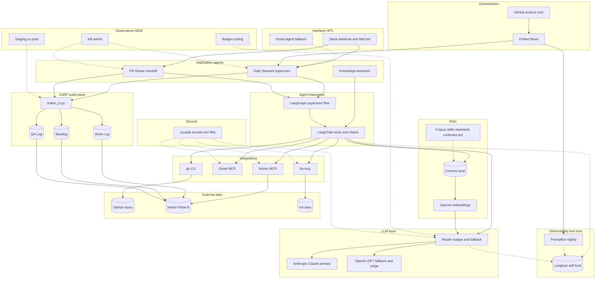
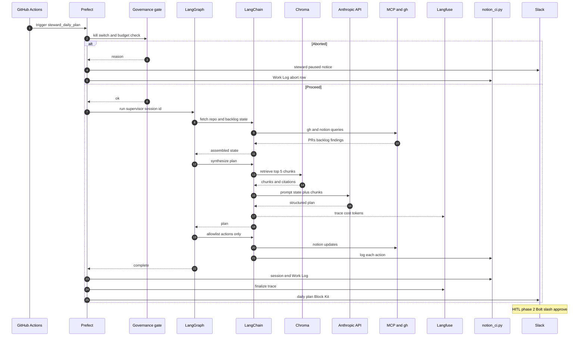
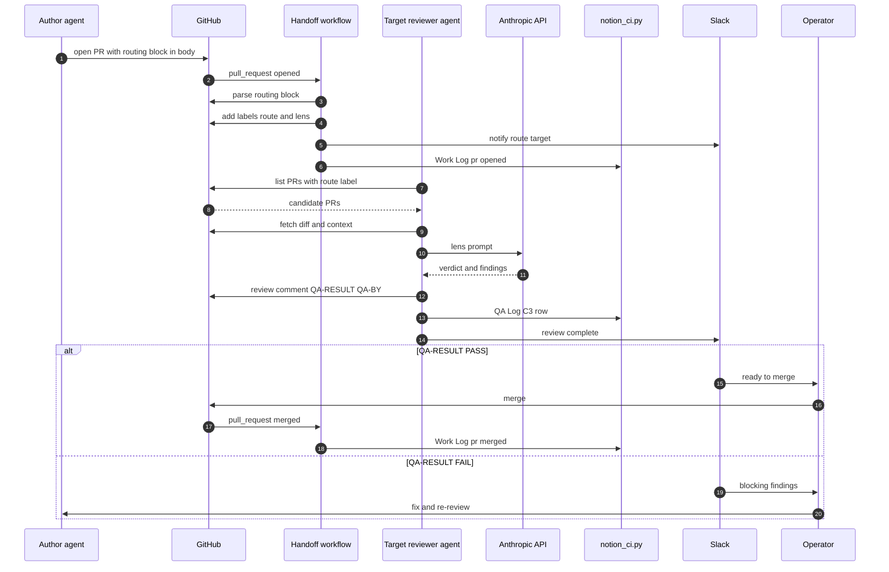

# AI Operations Stack (Reference Architecture)

**Status:** Draft v0.2 (2026-05-22 — companion to PRD v0.2; lean-first Phase 1)

**Companion:** [`docs/prd/PRD_AI_OPS_AND_HA_DELIVERY_FACTORY_v0.2.md`](../prd/PRD_AI_OPS_AND_HA_DELIVERY_FACTORY_v0.2.md)

**Runbook (planned):** `docs/runbooks/ai-operations-sop.md`

Industry-aligned reference architecture for RyzaLab multi-agent operations: steward, PR routing, RAG, observability, and SSRP audit. The diagrams below depict the **target architecture**; **Phase 1 ships lean-first** (direct Anthropic SDK + Pydantic + `rg` + JSONL traces) per PRD §4. LangChain, LangGraph, Prefect, Langfuse, Promptfoo, and Slack Bolt are deferred to Phase 2/3 and gated on the pain triggers in §Phase 1 default vs Phase 2/3 graduation below. Governance controls (budget ceiling, kill-switch, staging/prod) are required Day 3 of Phase 1, before any autonomous mode.

## Revision History

| Date | Author | Summary |
|------|--------|---------|
| 2026-05-21 | platform | Initial reference architecture and diagrams (Phase 1 + 2). |
| 2026-05-22 | platform | Re-anchored to lean-first Phase 1 default; companion PRD renamed to `PRD_AI_OPS_AND_HA_DELIVERY_FACTORY_v0.2.md`. Diagrams continue to depict the target architecture; tool-adoption gated on Phase 2/3 triggers. |
| 2026-05-23 | platform + operator | Phase 1 acceptance gate added per Gate 2 amendment: daily operator-visible dashboard (budget, drift, PR queue, HA package gates) required for Phase 1 acceptance. Lean surface only (Markdown/HTML + Slack); Langfuse / Bolt still Phase 2/3. Cross-reference to PRD §6.1. |

---

## Stack summary (one screen)

```text
┌─────────────────────────────────────────────────────────────────────────┐
│ LLM:     Anthropic Claude (primary) + OpenAI GPT (fallback + judge)     │
│ Agent:   LangChain + LangGraph (supervisor + subagents)                 │
│ RAG:     Chroma (local Docker) + OpenAI text-embedding-3-small          │
│ Orch:    Prefect 2.x + GitHub Actions cron (06:00 CT steward)           │
│ Obs:     Langfuse self-host + Promptfoo nightly eval                      │
│ HITL:    Slack webhook → Slack Bolt (/route /approve /backlog)          │
│ Tools:   MCP (Notion, Gmail, ha-mcp) + gh CLI                           │
│ Audit:   SSRP via notion_ci.py (Work Log / Backlog / QA Log)            │
│ Gov:     Budget ceiling + kill-switch + STAGE=staging|prod              │
│ Secrets: ~/.config/ryzalab/secrets-*.env                                 │
└─────────────────────────────────────────────────────────────────────────┘
```

**Legend:** Net-new infra = LangChain, LangGraph, Chroma, Langfuse, Prefect, Promptfoo, Slack Bolt, governance layers. Existing = MCP, `notion_ci.py`, Anthropic/OpenAI API usage patterns, GHA, secrets layout.

---

## Diagram 1 — Layered architecture



---

## Diagram 2 — Daily Steward execution flow



---

## Diagram 3 — PR routing handoff (System A)

Markers `QA-RESULT` / `QA-BY` must appear in **submitted review comments or PR comment bodies**, not only the PR description routing block. See [`docs/prompts/QA_REVIEW_CLOSEOUT.md`](../prompts/QA_REVIEW_CLOSEOUT.md).



---

## Layer reference

| Layer | Tool | Notes |
|-------|------|--------|
| LLM | Anthropic + OpenAI | Router with budget gate at 80% MTD |
| Agents | LangChain + LangGraph | Supervisor + tool nodes |
| RAG | Chroma + embeddings | Corpus: `agent-config/skills/`, `docs/standards/`, `docs/runbooks/`, `docs/prd/` |
| Orchestration | Prefect + GHA cron | Steward 06:00 CT; nightly eval |
| Observability | Langfuse | LangChain callbacks |
| Eval | Promptfoo | ~20 golden prompts after exemplars exist |
| HITL | Slack | Webhook first; Bolt in Phase 2 |
| Integration | MCP + gh | Canonical `notion_ci.py` in `ryzalab-notion-mcp` |
| Audit | SSRP | Enum-validated Work Log / Backlog / QA Log |
| Governance | Budget, kill-switch, staging | Required before autonomous allowlist |

---

## Phase 1 default vs Phase 2/3 graduation

**Phase 1 default (lean) — what actually ships in weeks 1-2:**

| Layer | Phase 1 tool |
|-------|--------------|
| LLM | Anthropic SDK + OpenAI fallback (multi-provider router, ~30 lines) |
| Structured outputs | Pydantic |
| Agent framework | Direct Python supervisor (~300-500 lines) |
| Retrieval | `rg` + cited file snippets |
| Orchestration | GitHub Actions cron + Python scripts |
| Observability | JSONL traces + cost ledger |
| HITL | Slack incoming webhook (no Bolt yet) |
| Audit | SSRP via `notion_ci.py` |
| Eval | Manual operator + paired session |

**Phase 2/3 graduation triggers — promote layer-by-layer when pain fires:**

| Add layer | Trigger |
|-----------|---------|
| LangGraph | 3+ repeated agent flows share patterns |
| Chroma / pgvector | grep precision drops < 70% OR corpus > 500 files |
| Prefect | 5+ recurring flows OR retry semantics matter |
| Langfuse self-host | > 100 LLM calls/day OR token-spend grows 10× |
| Slack Bolt + slash commands | In-Slack approvals required (not just digests) |
| Promptfoo + golden dataset | 20+ exemplar outputs exist to grade |

Do **not** defer: budget ceiling, kill-switch, staging/prod separation. These are Phase 1 Day 3 deliverables.

**Phase 1 acceptance gate (Gate 2 amendment, 2026-05-23):** Phase 1 is also not accepted without a daily operator-visible dashboard covering API budget, drift, PR/work-queue health, and HA package gate status. Acceptable surface is Markdown/HTML + Slack summary in under 2 minutes of operator read; Langfuse / Bolt / custom web app are still deferred to Phase 2/3. See [PRD §6.1](../prd/PRD_AI_OPS_AND_HA_DELIVERY_FACTORY_v0.2.md#61-acceptance-criteria--operator-visible-reporting-gate-2-amendment-2026-05-23).

---

## Related docs

- [`docs/prd/PRD_AI_OPS_AND_HA_DELIVERY_FACTORY_v0.2.md`](../prd/PRD_AI_OPS_AND_HA_DELIVERY_FACTORY_v0.2.md) — phased rollout (Phase 1 AI Ops MVP + Phase 1b HA Delivery Factory MVP + Phase 2), costs, success metrics, HA release gates, intern role boundary
- [`agent-config/CLAUDE.md`](../../agent-config/CLAUDE.md) — multi-agent governance
- [`docs/prompts/QA_REVIEW_CLOSEOUT.md`](../prompts/QA_REVIEW_CLOSEOUT.md) — QA markers
- [`docs/runbooks/platform-worktrees-ssrp-hooks.md`](../runbooks/platform-worktrees-ssrp-hooks.md) — SSRP hooks
