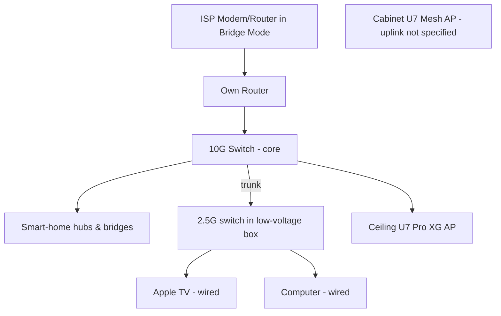

# Home Assistant Best Practices & Principles Standard

**Status:** Draft v1.0 (2026-07-10)  
**Owner:** RyzaLab Platform Architecture  
**Audience:** RyzaLab Operators, Smart Home Integrators, and AI-Ops Agents  
**Scope:** Architecture and automation design standards for Home Assistant deployments  

---

## Why this exists

RyzaLab needs one source-checked reference for the design decisions that make a Home Assistant deployment reliable enough for a non-technical household — so operators and AI-Ops agents make the same reliability-first choices on every install instead of re-deriving them per site. This standard codifies those choices (network foundation, protocol hierarchy, scene-first automation, presence without motion sensors, and the customer dashboard) and binds each claim to a cited source so downstream agents can trust it as ground truth. It is the "what/why to build" companion to the enforceable [HA Release Gate Standard](HA_RELEASE_GATE_STANDARD.md) ("prove it before it ships") and the [Customer Dashboard v1 spec](../ui/customer-dashboard-v1-spec.md).

---

## Executive Summary

This guide codifies core principles for network architecture, device selection, and automation design for reliable Home Assistant deployments. The concrete design choices are drawn from the Smart Home Solver video [*"How I'm Starting a New Smart Home from Scratch!"* (ID: U9PANPoOdm0)](https://www.youtube.com/watch?v=U9PANPoOdm0); the full transcript is reproduced in the appendix as the source of truth. Where this guide adds general engineering context beyond what the video states, that context is labeled as RyzaLab best practice rather than attributed to the video.

Building a smart home that withstands daily use by a family (the "Spouse/Family Approval Factor," **SAF/FAF**) requires moving away from fragile consumer setups toward a structured, reliability-first approach. This document turns those choices into a repeatable standard.

---

## 1. Foundational Network Architecture

A smart home is only as reliable as the local network it runs on. A congested or unstable Wi-Fi network leads to failed automations and a poor user experience.

### 1.1 ISP Modem/Router Isolation
*   **Bridge Mode:** Put the ISP-provided all-in-one modem/router into **Bridge Mode**, disabling its routing and Wi-Fi so you can run your own router without double-NAT.
*   **Dedicated Router:** Use a dedicated router (the video uses UniFi; an inexpensive TP-Link mesh is called out as a fine budget starting point).
*   **Rationale:** The video warns the ISP all-in-one "will crash at least once a week" if used as the router, and that a dedicated device avoids double-NAT. *(RyzaLab context: ISP boxes also tend to struggle under the many concurrent connections a smart home creates — this reasoning is general, not stated in the video.)*

### 1.2 Wired Backhaul, Minimal Wi-Fi
To keep Wi-Fi uncongested, hardwire static devices (computers, Apple TVs) and reserve Wi-Fi for devices that truly need it.



*Illustrative. The transcript specifies: ISP box in bridge mode, the creator's own router, a 10G core switch with the smart-home hubs/bridges and a ceiling-plugged U7 Pro XG on it, a 2.5G switch in the low-voltage box trunked to the 10G switch feeding wired room drops (computer, Apple TV), and a cabinet-hidden U7 Mesh AP. The mesh AP's exact uplink and the Home Assistant server's placement are not stated in the video.*

**What the video actually specifies:**
*   A **UniFi 10 gig switch** at the core, with a **U7 Pro XG** access point ceiling-mounted and plugged straight into it.
*   A second **U7 Mesh** access point hidden inside a cabinet in the kids' hangout area.
*   Wired devices (the computer and Apple TV) run to a **low-voltage box** containing a **2.5 gig switch**, which trunks back to the 10 gig switch alongside the smart-home hubs and bridges.

### 1.3 Enclosure Placement Principles
The video does not name specific enclosure brands, models, or the box type — it shows a "low-voltage box" housing the 2.5 Gig switch and a cabinet used to hide an access point. The following are RyzaLab best practices for those two placement decisions:

1.  **Low-voltage / structured-media enclosure (for the aggregation switch):**
    *   **Role:** The low-voltage box houses the compact 2.5 Gig switch that aggregates the room's wired drops and trunks back to the core switch. *(The video doesn't state the enclosure type; a recessed in-wall structured-media box is the conventional choice for this role.)*
    *   **Best practice — material:** Prefer **plastic (ABS) enclosures over metal**. A metal enclosure behaves like a partial Faraday cage and attenuates any RF radio placed inside it (Z-Wave, Zigbee, Thread, Bluetooth, or a mesh AP). Plastic is RF-transparent. If radios must live in a metal enclosure, mount their antennas outside it.
2.  **Cabinet-concealed access point:**
    *   **Role:** The video hides a U7 Mesh AP inside a cabinet in the kids' hangout area rather than mounting it on top for a stronger signal.
    *   **Trade-off (stated in the video):** On-top placement gives a better signal, but "until my kids see it and destroy it." Concealing the AP trades some RF performance for physical durability. This is a deliberate SAF/FAF call: a working-but-slightly-attenuated AP beats an exposed one that gets knocked down. Concealed placement "works surprisingly well" per the video, so verify real-world coverage rather than assuming the cabinet kills the signal.

---

## 2. Device Selection & Protocol Hierarchy

To minimize interference and maximize response times, select smart-home devices using a strict, reliability-based protocol hierarchy.

### 2.1 The Wireless Protocol Ladder
The video states an explicit sourcing priority based on the creator's reliability experience: **Z-Wave first, then Zigbee, then Thread, with Wi-Fi last.**

| Priority | Protocol | Operating Frequency | Key Strengths | Weaknesses |
|:---:|---|---|---|---|
| **1** | **Z-Wave** | Sub-1 GHz (~908 MHz in US) | • No interference with 2.4 GHz Wi-Fi<br>• Good wall penetration<br>• Strong certification/interop | • Higher device cost<br>• Low bandwidth (no video/audio) |
| **2** | **Zigbee** | 2.4 GHz | • Large device ecosystem<br>• Lower cost than Z-Wave<br>• Good mesh networking | • Shares 2.4 GHz with Wi-Fi<br>• Vulnerable to 2.4 GHz congestion |
| **3** | **Thread** | 2.4 GHz | • IP-based routing<br>• Mesh with border routers | • Still maturing (video defers it "until thread gets a lot better")<br>• Cross-ecosystem interoperability gaps |
| **4** | **Wi-Fi** | 2.4 / 5 / 6 GHz | • High bandwidth (cameras)<br>• No dedicated hub | • Congests the network<br>• Higher power draw<br>• Depends on router stability |

> The priority order and the Thread deferral are the video's stated preference; the per-protocol strengths/weaknesses columns and operating frequencies are general RyzaLab context, not claims from the video.
>
> Note: in the video, Z-Wave connects to Home Assistant via a Z-Wave USB radio stick — the creator calls out that Apple/Amazon/Google hub ecosystems generally *can't* talk to a Z-Wave wall switch, whereas HA can.

### 2.2 Hardware Recommendations (from the video)
*   **Multi-button scene controller:** The **Zooz ZEN32** Z-Wave scene controller — a hardwired (no-battery) wall switch with one primary relay button plus four customizable buttons whose LED color/brightness can be set as reminders of what each does.
*   **Lighting dimmers:** **Lutron** dimmer switches for the pendants and living-room ceiling lights. The video notes these Lutron dimmers use sub-1 GHz radio (like Z-Wave), so they don't interfere with Wi-Fi or the microwave. *(The video says "Lutron" without naming the line. Lutron's mainstream residential line, Caséta, uses Clear Connect at ~434 MHz — sub-1 GHz — but not every Lutron product is sub-1 GHz, so bind this claim to the Caséta / Clear Connect family.)*
*   **Dumb bulbs + smart dimmer:** For fixtures on a physical wall switch, install good-quality "dumb" bulbs (the video uses 3500 K) on a **smart dimmer switch** rather than smart bulbs. This keeps lighting working 100% of the time at the physical switch while remaining automatable — and avoids the classic failure where cutting power to a smart bulb makes it unreachable and desyncs automation state.

### 2.3 RF Spectrum Interference & the Microwave
The video makes a specific, checkable claim: **Lutron and Z-Wave use sub-1 GHz radio, so they don't interfere with Wi-Fi and "things like the microwave that uses 2.4 GHz."**

RyzaLab context on why this matters:
*   **2.4 GHz is crowded.** Wi-Fi (2.4 GHz band), Zigbee, Thread, and Bluetooth all share it, as do most Wi-Fi/Zigbee smart bulbs.
*   **Microwave ovens emit near 2.45 GHz.** Because oven shielding is imperfect, a running microwave leaks energy into the 2.4 GHz band and can cause packet loss or dropouts for nearby 2.4 GHz devices while it runs.
*   **Sub-1 GHz sidesteps this.** Z-Wave (~908 MHz in North America) and Lutron's Clear Connect radio (~434 MHz, as in Caséta) operate well below 2.4 GHz, so they are **not affected** by microwave leakage or 2.4 GHz Wi-Fi congestion. This makes sub-1 GHz wall switches a strong default for kitchen-adjacent and safety-relevant controls.

---

## 3. Automation and Scene Design Principles

A resilient Home Assistant deployment separates state definition (scenes) from automation triggers and adds failsafes for predictability.

### 3.1 Scene-First Architecture
Define lighting/environment states as **Scenes** before writing automations.

*   **How it works (from the video):** The living room has five scenes — bright (all on), a second all-on but dimmer, pendants-only, a very-dim TV scene, and everything-off.
*   **Why:** Scenes centralize state. Adding a bulb or changing a dim level means editing **one** scene; every button press, dashboard control, and automation that runs that scene inherits the change automatically.

```
[Zooz Wall Button] ────┐
                       │
[HA Dashboard] ────────┼──> Triggers ──> [HA Scene: TV Mode] ──> Sets Light States
                       │
[Apple TV Playing] ────┘
```

### 3.2 Parallel Automation Mode
*   **The issue (demonstrated in the video):** New automations default to **Single Mode**. When the family pressed the wall buttons rapidly, presses were dropped while the first run was still processing — the switch felt broken.
*   **The fix:** Set the automation to **Parallel** mode for multi-button controllers like the ZEN32, so rapid, concurrent button presses each get processed instead of being dropped. *(Parallel mode permits concurrent runs; it does not by itself guarantee conflict-free entity changes, so keep each button's actions independent.)*

```yaml
mode: parallel
max: 10   # example concurrency cap; the video only calls for switching to parallel mode
```

### 3.3 Context-Aware Presence (No-Motion-Sensor Strategy)
The video deliberately avoids motion sensors for its first automations, because a sensor that misfires (e.g., with two desks back-to-back) drops SAF and creates "an angry mob." Instead it derives presence from devices already in use. (The creator notes sensors will be added later — this is a reliability-first starting point, not a ban on sensors.)

*   **TV-state integration:** Tie living-room lighting to the Apple TV media state.
    *   *Condition:* Skip the scheduled evening dimming if the TV is playing.
    *   *Action:* Switch to the dim "TV" scene when playback starts; restore normal lighting when it stops.
*   **Workstation presence:** Drive desk light strips off the computer's state **plus** a second-screen connection, so the lights come on only at the desk — not when using a laptop on the couch.
*   **Lock-driven room mode (the shop):** Unlocking the smart lock turns on lights, lowers the thermostat, and starts music; locking it shuts everything down.
    *   *Override:* A dashboard control disables the auto-shutdown when locking from the inside, so the room stays on during focused work.

---

## 4. Customer Dashboard Design

The video shows the creator using a Home Assistant dashboard as an override control but does **not** name a specific dashboard repository, theme, or card set. RyzaLab does not chase a specific creator's setup here — the canonical customer dashboard standard is the **[RyzaLab Customer Dashboard v1 Spec](../ui/customer-dashboard-v1-spec.md)** (with the accompanying [`RYZALAB_CONTROL_DASHBOARD_SPEC_v0.1`](../prd/RYZALAB_CONTROL_DASHBOARD_SPEC_v0.1.md) PRD). Build customer dashboards from that spec; this section summarizes it and shows the target layout.

### 4.1 Native-First, Seven-View Information Architecture
The spec's core pattern: a native Home Assistant dashboard that reads like a command center, not a raw entity registry. Home answers *"Is my house okay, and what do I usually control?"* in ~5 seconds; the remaining views organize daily controls by household job; diagnostics are quarantined to System Health.


*Low-fidelity wireframe (open-format SVG). Source of truth: [`docs/ui/customer-dashboard-v1-spec.md`](../ui/customer-dashboard-v1-spec.md) — not a production layout.*

| # | View | Customer question |
|:--:|------|-------------------|
| 1 | **Home** | Is my house okay, and what do I usually control? |
| 2 | **Rooms** | What can I control in this room? |
| 3 | **Routines** | What mode should the house be in? |
| 4 | **Security** | Are doors, locks, cameras, and motion okay? |
| 5 | **Comfort** | Is the house comfortable? |
| 6 | **Media** | What is playing, and where? |
| 7 | **System Health** | What needs attention or RyzaLab support? |

**Responsive:** each Sections view sets one `max_columns`; Home Assistant collapses it per viewport — phone (1 column), tablet (2), wall/desktop (up to 3). Phone Home must order **Now, Usual Actions, Security Snapshot** first.

### 4.2 Component Dependency Ladder
Match the spec's ladder — buy visual polish only when a native card is materially worse, and never without a native fallback:

*   **Tier 0 — Native only (baseline for v1):** Sections view, Heading, Tile, Area, Button, Conditional, and Markdown cards plus built-in domain cards. Durable across HA updates and easy to hand off.
*   **Tier 1 — Low-risk enhancement (defer until Tier 0 pilots):** centralized theme tokens, dashboard icon/title, and — only where the customer repo already supports HACS and a native card can't deliver a clearer control — limited **Mushroom Cards** ([`piitaya/lovelace-mushroom`](https://github.com/piitaya/lovelace-mushroom)) or version-pinned **Auto-Entities** ([`thomasloven/lovelace-auto-entities`](https://github.com/thomasloven/lovelace-auto-entities)) for System Health.
*   **Tier 2 — HACS/custom-card stack (demo-only exception):** e.g. **Card Mod** ([`thomasloven/lovelace-card-mod`](https://github.com/thomasloven/lovelace-card-mod)) or **Bubble Card** ([`Clooos/Bubble-Card`](https://github.com/Clooos/Bubble-Card)). Adopt only with a documented exception, a native fallback, and a version pin — these are `card-not-found` liabilities on HA frontend updates.
*   **Tier 3 — Custom frontend:** out of scope for v1.

The HACS repos linked above were reachable as of this standard's Revision-history date; links decay, so re-confirm any repo (and its license) still exists before citing it in a customer deliverable — see [Tripwires](#tripwires).

---

## Tripwires

Revisit this standard when any of the following occurs:

- **Protocol hierarchy shifts:** Thread/Matter devices in RyzaLab's target categories reach parity with Zigbee on first-try commissioning and on 30-day connection stability across ≥2 pilot sites — at which point the §2.1 ladder (Z-Wave > Zigbee > Thread > Wi-Fi) must be re-ranked.
- **A referenced external repo goes dead:** any HACS repo or spec link in §4 returns 404 or is archived — remove or replace the reference, and re-verify the remaining links are live before the next customer deliverable cites them.
- **The Customer Dashboard spec supersedes §4:** when [`customer-dashboard-v1-spec.md`](../ui/customer-dashboard-v1-spec.md) advances past v1 or the native-first Tier 0→3 ladder changes, re-sync §4 rather than letting the two drift.
- **Home Assistant deprecates a construct** relied on here (Sections view, Tile/Area/Conditional cards, `mode: parallel`) — re-validate the affected section against current HA docs.
- **A site incident** traces to guidance in this doc (e.g., a sub-1 GHz claim that didn't hold, or a presence pattern that misfired) — record it in Revision history and correct the section.

## Out-of-scope

The following are deliberately **not** covered here; each has a deferral trigger for when it should be:

- **Production YAML / per-site configuration** — this standard is design guidance only. Actual dashboard and automation config lives in customer repos under the [HA Release Gate Standard](HA_RELEASE_GATE_STANDARD.md). *Deferral trigger: a pilot site is chosen and needs an implementation artifact.*
- **Device selection records** — specific make/model classification is owned by the [Device Classification Methodology](../DEVICE_CLASSIFICATION_METHODOLOGY.md) and the `ryzalab-iot-device-research` flow, not this doc. *Deferral trigger: a device named here (Zooz ZEN32, Lutron dimmers) needs a formal Verified Device Standard row.*
- **Network hardware sizing / VLAN & segmentation design** — §1 gives the topology principle (bridge mode, wired backhaul, minimal Wi-Fi), not a per-site network engineering spec. *Deferral trigger: a site requires VLAN/IoT-segmentation or PoE-budget planning.*
- **Non-Home-Assistant platforms** (SmartThings, Hubitat, vendor clouds) — out of scope; RyzaLab standardizes on HA. *Deferral trigger: a customer constraint forces a non-HA hub.*

## Revision history

| Date | Author | Version | Summary |
|------|--------|---------|---------|
| 2026-07-10 | platform | v1.0 (Draft) | Initial standard. Codifies reliability-first HA design (network foundation, Z-Wave>Zigbee>Thread>Wi-Fi protocol ladder, sub-1 GHz vs 2.4 GHz interference, scene-first automation, `mode: parallel`, presence without motion sensors) derived from the Smart Home Solver "Starting a New Smart Home from Scratch" build. Video-derived claims are bound to the appended transcript; §4 dashboard guidance is sourced to the Customer Dashboard v1 spec/PRD (with an SVG wireframe); general engineering context is labeled as RyzaLab best practice. |

---

## Appendix: Complete Video Transcript

Below is the timestamped transcript of `U9PANPoOdm0`, used as the source of truth for this standard.

```text
[00:00] I'm setting up my new smart home, and
[00:01] it's not just going to be any smart
[00:03] home. It's going to be the best, rock
[00:06] solid and bulletproof my family trying
[00:08] to destroy it. Because, trust me,
[00:10] they're going to try. That means better
[00:12] devices, better automations, and none of
[00:15] the mistakes I've made in the past.
[00:17] Let's do this. But wait, before I can
[00:19] even begin, I have to set up a good home
[00:22] network. If I have a bunch of devices
[00:24] all over my house and they can't
[00:26] communicate because of a weak signal or
[00:29] the network crashes, well, my smart home
[00:31] will be terrible from the start. So, the
[00:34] first thing that I did was change the
[00:36] all-in-one modem router Wi-Fi device
[00:38] from my ISP into bridge mode. That way I
[00:41] can use my own device for a router and
[00:44] Wi-Fi without double NATing and causing
[00:46] problems. And warning, if you do end up
[00:49] using that all-in-one device from the
[00:51] ISP as your router, it will crash at
[00:53] least once a week and you'll be
[00:55] miserable. I know because I used to use
[00:57] mine years and years ago, and it was the
[00:60] worst.
[01:02] >> The worst.
[01:04] >> Don't do it. So, I'm going to be using
[01:06] UniFi again, but with some upgrades. And
[01:08] don't feel pressured to use an expensive
[01:11] UniFi system. An inexpensive TP-Link
[01:13] mesh system will work well if you're
[01:15] just starting out or on a tight budget.
[01:18] For UniFi, I've upgraded to a 10 gig
[01:19] switch and a U7 Pro XG wireless access
[01:23] point plugged straight into it. And hey,
[01:25] I mounted it to the ceiling, which
[01:27] wasn't that difficult to do. I also have
[01:29] a U7 mesh Wi-Fi access point hidden in a
[01:32] cabinet that works surprisingly well in
[01:34] there. I know for a better signal I
[01:36] could put it on top of the cabinet, but
[01:39] do you know where this cabinet is?
[01:41] Right outside the kids' rooms in their
[01:43] little hangout area. Sure, I might have
[01:45] a better signal for a few days until my
[01:47] kids see it and destroy it. When you
[01:50] live with a pack of wild animals, you
[01:53] have to take the proper precautions.
[01:55] These two wireless access points
[01:57] completely cover my house with a good
[01:59] Wi-Fi signal. But, as you will see, I
[02:02] try to use as little Wi-Fi as possible.
[02:05] My computer and devices like the Apple
[02:07] TV have a hardwired connection to the
[02:09] Ethernet port in the room. Those
[02:11] Ethernet wires run to the low-voltage
[02:13] box where I have a 2.5 gig switch
[02:15] connecting them, and all of that
[02:17] connects directly to the 10 gig switch,
[02:19] which is also connected to my smart home
[02:21] hubs and bridges. That way, if a smart
[02:23] home device has to use Wi-Fi, it's not
[02:26] overly congested and much more reliable.
[02:28] I also have a detached shop that I added
[02:30] a Wi-Fi access point to, and I'll be
[02:32] talking about how I got the network out
[02:33] here in a separate video. So, make sure
[02:35] you're following the channel. And let me
[02:37] tell you, the speeds are extremely fast.
[02:40] It's way better than I thought it was
[02:42] going to be. Getting my network to where
[02:43] it is right now took a decent amount of
[02:46] work. It was 100% worth it though to
[02:48] have a solid foundation to build my
[02:50] smart home on. All right, now I can
[02:52] finally start setting up my smart home.
[02:55] First, I need a solid smart home
[02:57] platform to control all my devices. I've
[02:59] used pretty much all the smart home
[03:01] systems out there, and in my opinion,
[03:03] there's one clear winner. That's Home
[03:06] Assistant. When I first started this
[03:08] channel, I'd almost get annoyed by all
[03:10] the people saying, "Just use Home
[03:12] Assistant." Home Assistant. Home
[03:14] Assistant. Home Assistant. But now, I'm
[03:17] a huge Home Assistant fan. It connects
[03:19] to basically every smart home device in
[03:21] existence. It's extremely powerful, so I
[03:24] can dial in my automations exactly how I
[03:26] want them. Plus, it's free and open
[03:28] source. It used to be for the super
[03:31] nerds out there, but it's gotten way
[03:33] easier to use. Like, you can buy a Home
[03:35] Assistant Green, and everything comes
[03:37] pre-installed. Not only that, they've
[03:39] really improved the user experience for
[03:41] people getting started. I can't think of
[03:44] one reason not to use Home Assistant.
[03:46] And if you disagree with me, come at me,
[03:49] bro. I made a step-by-step video on how
[03:51] to get started with it, and I'll link it
[03:53] down below to watch after this video.
[03:55] Now, it might be tempting to go with a
[03:57] more simple smart home system, but if
[03:59] you watch this whole video, it'll be
[10:01] very clear why some of those other
[10:02] systems fall short. So, now that my
[10:04] smart home system is up and running, I'm
[10:06] ready to add devices. I always get
[10:09] asked, "What should I buy first?" or
[10:11] "Where do I even get started?" Well,
[10:13] luckily, it's really simple to figure
[10:15] out. Here are my two main things I
[10:17] consider. One, what's the most annoying
[10:20] problem in my home right now? And two,
[10:23] is it in an area that gets used a lot?
[10:25] If it's yes to both of those, I'll start
[10:27] there. So, my kids' rooms, yeah, sorry,
[10:30] but they can wait. Automating this
[10:32] plant? Not going to make that initial
[10:35] cut. Poor plant, it wasn't automated
[10:37] because of the move, and look what
[10:39] happened to it. Sad. I do have a couple
[10:42] of places in my house that meet both
[10:44] criteria, though. As I showed in my last
[10:46] video, if the ceiling fan and ceiling
[10:48] lights are both on, then the shadows
[10:50] from the fan are super annoying. This is
[10:53] in our living room, which definitely
[10:54] gets used a lot, so these need to be
[10:56] smart ASAP. But, I don't want just any
[10:59] smart fan switch. Remember, I'm trying
[11:01] to build the best smart home, so I need
[11:04] something that can control more than
[11:05] just the fan. I want the switch to have
[11:08] extra buttons to control my smart home
[11:10] devices in the room, and I found this
[11:12] Zooz ZEN32 that perfectly fits the bill.
[11:16] I can customize what each button does,
[11:18] but not only that, I can set the color
[11:21] and brightness for each button light, so
[11:24] I can actually remember what the button
[11:26] does. The white button makes it bright
[11:28] in the room, orange makes all the lights
[11:30] dim, blue controls the fan across the
[11:33] room, and the button with no light turns
[11:35] everything in the room off. That even
[11:37] includes turning off the TV. It's
[11:39] amazing. This switch is super
[11:41] family-friendly and easy to use. Rule
[11:44] number two, check. Grandma can come over
[11:46] and use that no problem. Okay, to be
[11:49] fair, I would have to give a quick
[11:50] explanation on what the buttons do. Even
[11:52] if she forgot though, she could just
[11:54] start pressing the buttons until
[11:55] everything turned off. Plus, there are
[11:57] no batteries to worry about since it's a
[11:59] wired switch and it's extremely reliable
[12:01] because it uses Z-Wave. This is a good
[12:04] example of why going with a simple smart
[12:06] home system falls short because Apple,
[12:09] Amazon, or Google smart home systems
[12:11] can't connect to the smart switch. But
[12:13] with Home Assistant, just connect a
[12:15] Z-Wave radio USB stick and you're good
[12:17] to go. Another annoyance in my house in
[12:20] this high traffic area are these pendant
[12:22] lights. I love how they look, but they
[12:25] are very visible when we watch TV. It's
[12:28] also really annoying to walk around and
[12:29] hit the switch to turn them off when
[12:31] we're watching something. Extra walking?
[12:34] No, unacceptable. I have to make them
[12:36] smart. But how? Well, in my last home, I
[12:39] had smart bulbs in the pendant lights
[12:42] and controlled them with a smart switch.
[12:44] It worked fine, but I'm trying to make
[12:46] everything more reliable. So instead, I
[12:48] put good quality dumb bulbs in. I won't
[12:50] be able to change the color, but they're
[12:52] already my favorite 3500 Kelvin white,
[12:55] so that's okay. And I'm using a smart
[12:58] dimmer switch to control them. That way
[13:00] it works 100% of the time if the
[13:02] physical switch is used and I can still
[13:04] automate them. I'm using Lutron dimmer
[13:06] switches for these pendants and the
[13:08] living room ceiling lights. Just like
[13:10] Z-Wave, Lutron uses sub-1 GHz radio
[13:13] signals to communicate, so it doesn't
[13:15] interfere with Wi-Fi and things like the
[13:17] microwave that uses 2.4 GHz. That's why
[13:20] they work so well. I'm still going to
[13:22] use smart home devices that use Wi-Fi,
[13:24] thread, and Zigbee and I've started
[13:26] setting them up in this house. They also
[13:28] work good. But here's my priority for
[13:30] choosing a device to be used in my smart
[13:32] home. First, I'll see if there's a
[13:34] Z-Wave version. If not, I'll look for
[13:37] Zigbee, then thread, and Wi-Fi being my
[13:40] last choice. That order is based on my
[13:42] experience with reliability of each
[13:44] protocol. So, until thread gets a lot
[13:47] better, I'll prioritize Z-Wave and
[13:49] Zigbee devices. That's just my
[13:51] preference. Now that I have some smart
[13:53] switches set up, it's time to start
[13:55] automating. But before jumping in and
[13:57] writing automations, it's first helpful
[13:59] to create scenes. Those will set the
[14:02] brightness levels of all the lights, and
[14:04] it'll make it much easier to manage
[14:06] long-term because everything is in one
[14:08] spot. Let me show you what I mean. I
[14:10] created five scenes for this living
[14:12] room. A bright one with all the lights
[14:15] on, another with all the lights on, too,
[14:17] but less bright, a third scene with just
[14:21] the pendant lights on, a fourth that is
[14:24] super dim for watching TV, and a last
[14:26] one with everything off. Now I can run
[14:29] those scenes in many different ways. I
[14:31] can turn them on from pressing a button
[14:32] on the wall switch, using a smart home
[14:34] dashboard, or even an automation. If I
[14:37] ever want to update the brightness
[14:38] levels or add a light to the room, I
[14:40] just update that one scene, and then it
[14:42] updates all the automations and button
[14:44] presses and all that. So, that's why
[14:46] creating scenes first and using them is
[14:49] super useful. Okay, finally for the best
[14:51] part, automating the smart home devices.
[14:54] Starting first with the ceiling fan and
[14:56] lights in the living room. My kids call
[14:58] these giant spiders, but I call them a
[15:01] giant headache. Luckily, it's an easy
[15:03] fix. I don't want them on at the same
[15:05] time, so I created an automation that
[15:07] makes it so it never happens again.
[15:10] Look, if the fan is on and I turn on the
[15:12] lights, the fan turns off. If the lights
[15:15] are on and I turn on the ceiling fan,
[15:16] then the lights turn off. Take that,
[15:18] family. No one can have both on at the
[15:21] same time. And don't worry, this
[15:23] automation is easy to set up. I could
[15:25] create two automations for this to work,
[15:27] but with Home Assistant, it's possible
[15:29] to do this with just one automation. I
[15:31] created [clears throat] two triggers,
[15:32] one if the fan turns on, and another if
[15:35] the light turns on. Click on edit ID and
[15:39] give it a name that is easy to tell
[15:40] which trigger it is. That way I know
[15:42] what device turned on to trigger this
[15:44] automation. For the action, select
[15:46] choose and for the option, give it two
[15:49] conditions. If the light turns on from
[15:52] the trigger and if the fan is already
[15:54] on,
[15:55] make an action to turn off the fan so
[15:58] they're not on at the same time. Then,
[16:00] the same thing but opposite for the
[16:02] lights. Easy. This is how I program all
[16:05] the buttons on the Zooz switch. The same
[16:07] automation gets triggered for each
[16:09] button press. Using the trigger ID, I
[16:12] know which button was pressed, but I can
[16:13] do different actions based on a single
[16:15] press, double press, or holding down the
[16:18] button. That way you can do things like
[16:20] double press the fan button to make it
[16:21] go full speed or hold it down to turn
[16:23] off the fan. I was so excited to show my
[16:26] family, I brought them over and guess
[16:28] what happened? It didn't work. What? My
[16:32] test subjects, I mean, my family were
[16:35] pressing the buttons fast and it wasn't
[16:37] changing the lights.
[16:38] >> working.
[16:39] >> No.
[16:40] >> Dad, you said it worked.
[16:42] >> I thought it was going to turn on the
[16:43] light.
[16:44] >> I forgot to do one crucial step that
[16:46] allows anyone to press the buttons fast.
[16:49] Change the automation mode. By default,
[16:52] a new automation runs in single mode,
[16:54] which is perfectly fine for most
[16:55] automations. But for this, it needs to
[16:59] be changed to parallel mode. That way I
[17:01] can press the buttons fast and turn on
[17:03] the fan and then the lights and it won't
[17:05] fail since it can run the same
[17:07] automation with different actions
[17:08] simultaneously. I also created some
[17:11] basic automations to turn the lights on
[17:13] and off. They turn on at 4:30 p.m. right
[17:15] before dinner, they dim at sunset, and
[17:18] turn off around bedtime. And this type
[17:20] of schedule works great for us. But
[17:22] remember how those pendant lights
[17:23] reflect on the TV? I don't want them
[17:26] turning on automatically from a schedule
[17:28] while we're watching TV. And if I was
[17:30] using a more simple smart home system, I
[17:33] would be out of luck. But with Home
[17:34] Assistant, it's really easy. I'm using
[17:37] the Apple TV here in my living room, and
[17:39] I can add a condition to skip the lights
[17:41] changing in the evening if the TV is on
[17:43] and playing. I can also take it a step
[17:46] further and automatically dim the lights
[17:48] to that scene I created earlier if the
[17:50] TV is playing something, and turn the
[17:52] lights back up when it's done. Ali and I
[17:54] have been watching Parks and Rec with
[17:56] our 11-year-old every night, and these
[17:57] automations let us settle in and relax
[18:00] quicker. Priceless. This is so much
[18:03] better than getting up and walking
[18:05] around the counter to turn off those
[18:06] pendant lights. And this automation
[18:09] makes me extremely happy and reminded me
[18:12] how much I missed my automations during
[18:14] the move. I didn't stop there though
[18:16] with the new automations. I wanted my
[18:18] desk light strips to automatically turn
[18:20] on when I'm sitting at the computer and
[18:22] turn off when I leave. I didn't want to
[18:25] use a sensor because it could get false
[18:27] detections with Ali's desk right behind
[18:29] mine, and I wanted it to be super
[18:32] accurate. So, I just set up an
[18:34] automation to turn on the lights
[18:35] whenever my computer turns on and it's
[18:38] connected to a second screen. That way
[18:40] the lights aren't turning on when I'm
[18:41] using my laptop on the couch, but only
[18:44] when I'm actually at the desk. Look how
[18:46] responsive it is at turning the lights
[18:48] on and off. I love it. What about
[18:50] automating the lights, thermostat, and
[18:52] music in the shop? Well, I learned a
[18:54] super useful automation technique when I
[18:56] was touring Riley's house years ago. If
[19:00] the smart lock unlocks, then turn on the
[19:01] lights, turn down the temperature, and
[19:04] start playing music. Nothing like an
[19:06] automation to get me focused on work.
[19:08] When I'm all done, I lock the door and
[19:10] everything turns off. It's so seamless.
[19:14] If the kids ever start barging in while
[19:15] I'm working, I might have to lock the
[19:17] door while I'm in here. If so, I would
[19:19] just disable the shutdown automation and
[19:22] use this dashboard to turn everything
[19:23] off. But for now, it's working great.
[19:26] All right, now for the elephant in the
[19:28] room. You might have noticed with all of
[19:30] these automations, I didn't use a motion
[19:32] sensor or any kind of typical smart home
[19:34] sensor. Of course, I'm going to use
[19:36] smart home sensors in the future, but
[19:38] they definitely make things more
[19:40] complicated. You could set up a motion
[19:42] sensor really fast and it could work 98%
[19:44] of the time, but if the lights are
[19:46] turning on or off when they're not
[19:48] supposed to, spouse approval factor can
[19:50] drop significantly and you could have an
[19:52] angry mob on your hands. But by
[19:54] automating with devices already around
[19:56] the house like the TV, computer, or door
[19:58] lock, it's much more predictable and
[20:00] less annoying. Just something to keep in
[20:02] mind. I'll admit, when moving there were
[20:05] some nice benefits of a dumb home. I
[20:07] mean, it's about as reliable and
[20:08] predictable as it gets. So, that's why I
[20:10] really like my current setup because I
[20:12] get all the benefits of a dumb home
[20:14] without the annoyances of a smart home.
[20:17] I might have cracked the code. I'm
[20:19] following all my smart home rules and
[20:20] it's working. I'm having so much fun
[20:23] setting my smart home back up and making
[20:25] it better than ever. Thanks for
[20:26] watching.
[20:29] >> [music]
[20:31] >> Hey Dad, when can I get smart home stuff
[20:33] in my room?
[20:34] >> Eh, it might be a while.
[20:40] Woah, who did this? Hey, you guys need
[20:41] to take this off right now.
[20:42] >> Eh, it might be a while.
```
